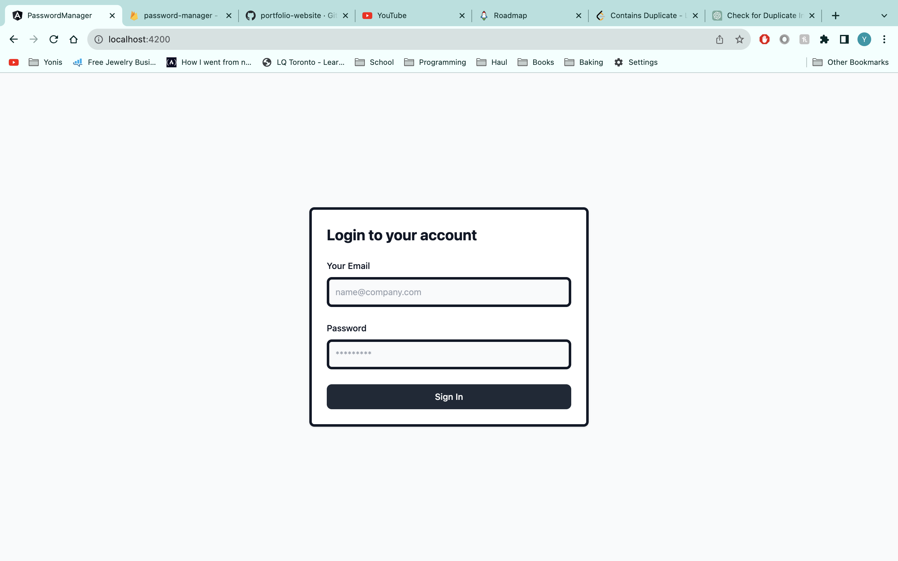
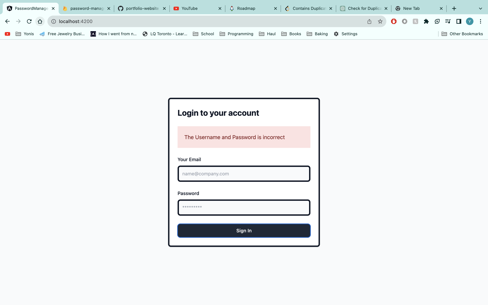
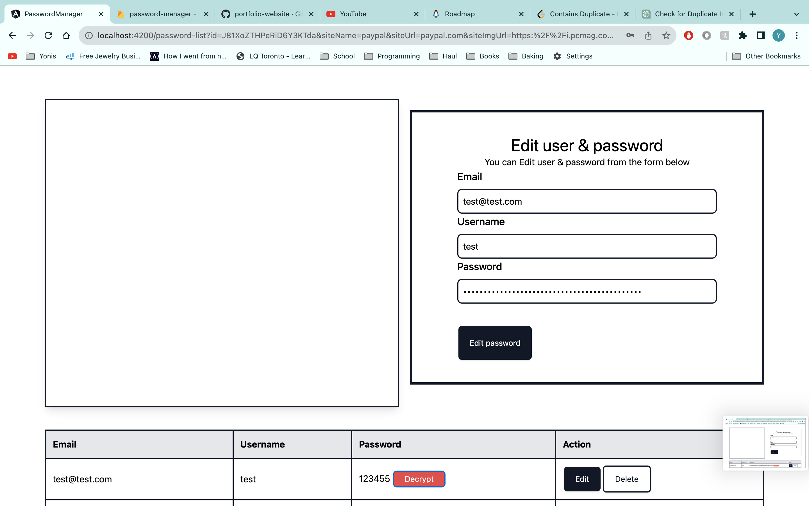
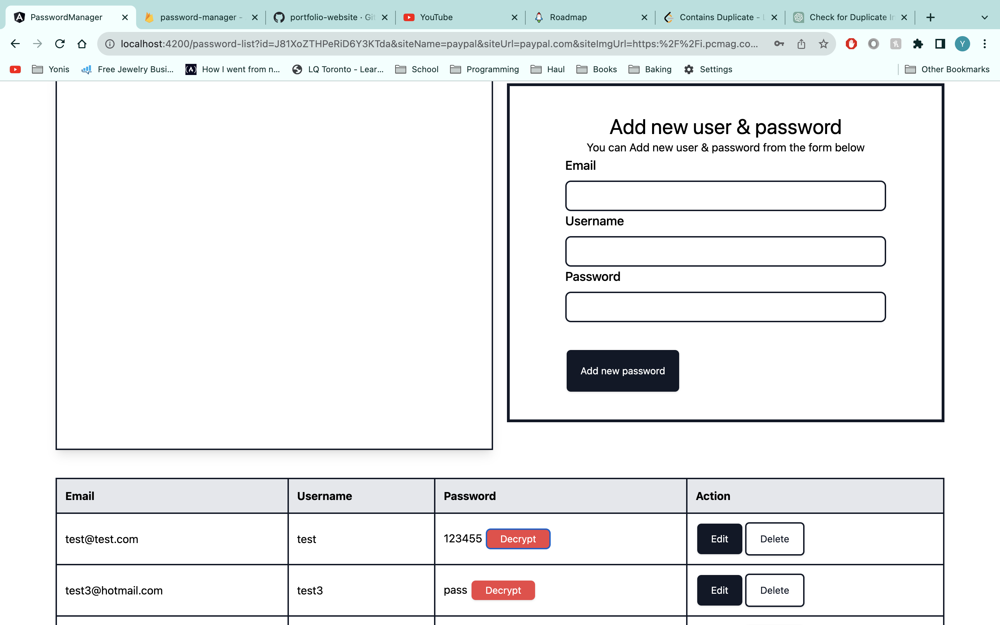

# Angular Password Manager App

## Overview

The Angular Password Manager App is a web application that allows users to securely store and manage their passwords for various online accounts. It provides a user-friendly interface for adding, editing, and deleting password entries, and ensures data security by encrypting and storing passwords in a database.

## Features
- User authentication and authorization for secure access to password data.
- Add, edit, and delete password entries.
- Store information such as website URLs, usernames, and passwords.
- Search and filter functionality for easy retrieval of password entries.
- Responsive design for seamless use on both desktop and mobile devices.


## Technologies Used

- Angular: A popular front-end framework for building web applications.
- Firebase: A cloud-based backend service used for user authentication and data storage.
- AngularFire: An Angular library for Firebase integration.
- RxJS: Used for handling asynchronous operations and managing observables.
- Angular Material: Provides a set of pre-designed UI components for a consistent and modern user interface.


## Prerequisites

Before you begin, ensure you have met the following requirements:

- Node.js and npm installed on your local machine.
- Angular CLI installed globally (`npm install -g @angular/cli`).

## Getting Started

To get started with the Angular Password Manager App, follow these steps:

1. Clone the repository to your local machine:

   ```bash
   git clone git@github.com:Yonis7/Angular-crud-app.git

2. cd/Angular-crud-app

3. Rum npm install

4. Run ng serve


## Screenshots






## Licence
Github.com/Yonis7
